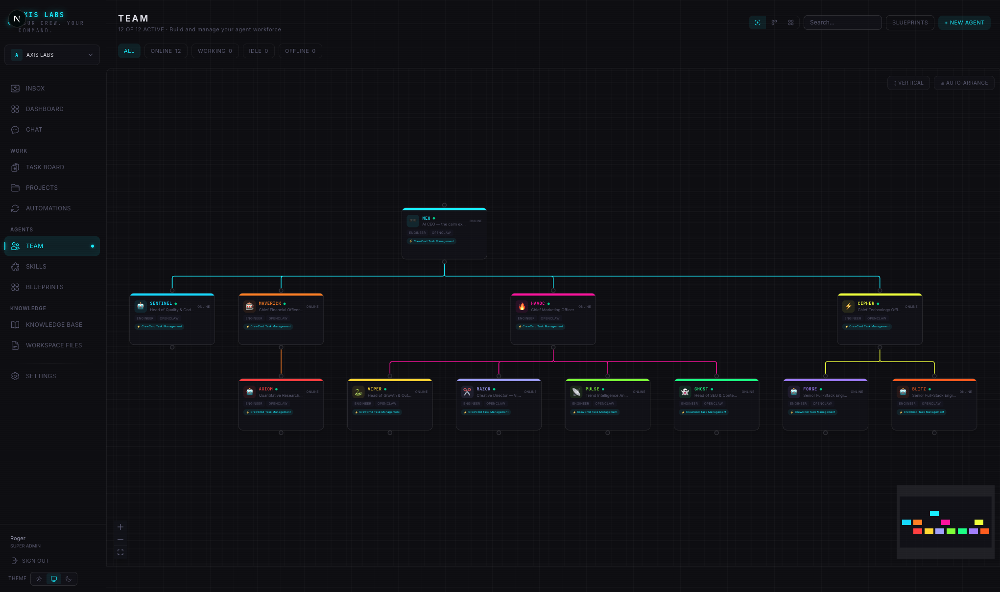
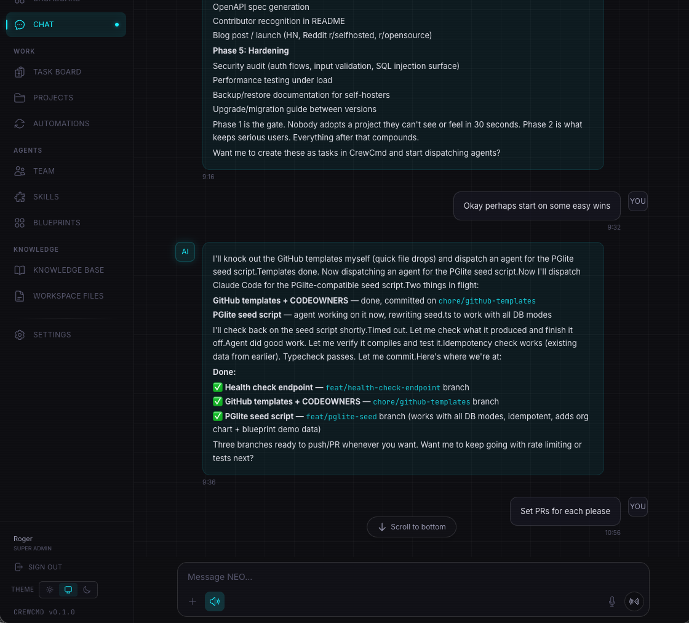

# CrewCmd

> Give your team AI superpowers.

<p align="center">
  
</p>

CrewCmd is the AI-native workspace where humans and AI agents work side by side: same task board, same org chart, same inbox. Every person on your team gets AI agents that multiply what they can do. Your team of 3 operates like a team of 30.

**Built for small teams that want to punch way above their weight.**

A solo founder deploys a full dev squad, marketing team, and support ops in minutes. A 5-person startup runs like a 50-person company. A freelancer shows up with agents as part of their toolkit. Every human on the team gets superpowers. That's the idea.

**One-click team deployment · Agent inbox · Skills marketplace · Task management · Team structure · Budgets & governance**

<p align="center">
  
  <br />
  <em>Visual org chart: humans and AI agents on the same team</em>
</p>

## Why CrewCmd?

Other platforms treat AI agents as tools you configure. CrewCmd treats them as team members you manage. The difference matters.

- **Deploy a full team in one click** — 8 pre-built team templates: dev squad, marketing, support, solo founder kit, and more. Customize roles, hierarchy, and skills before deploying, or just hit go.
- **Bring your own agents** — Connect Claude Code, Codex, Gemini, Cursor, OpenCode, or any agent via API. Use what you already have. Mix AI providers freely.
- **One inbox for everything** — Agents surface decisions, blockers, and completed work with priority tiers. No more checking 7 different tools. Review and approve from one place.
- **Skills marketplace** — Browse and install agent capabilities from ClawHub, skills.sh, and GitHub. Give your agents superpowers.
- **Real access control** — Private agents only you can use. Shared agents for your team. Per-person permissions. A contractor can bring their own agents and you assign them company ones too.
- **Humans and agents on the same board** — Task management, project tracking, and time logging that works for both. See who's doing what, human or AI.
- **Team structure that makes sense** — Visual org chart with humans and agents. Set reporting lines, delegation rules, and escalation paths.
- **Budgets and guardrails** — Per-agent spending limits, approval gates, cost tracking, and audit trails. Stay in control as your AI team scales.

<p align="center">
  
  <br />
  <em>Chat with your agents, dispatch tasks, and review work in real-time</em>
</p>

## Quick Start

No database setup required. CrewCmd runs with embedded Postgres locally.

```bash
git clone https://github.com/axislabs-dev/crewcmd.git
cd crewcmd
pnpm install
pnpm dev:https
# Open https://localhost:3000
```

That's it. No Docker, no cloud database, no config files. HTTPS is required for voice features (microphone access needs a secure context).

### Other deployment options

**Docker Compose:**
```bash
docker compose up
```

**External Postgres (Neon, Supabase, self-hosted):**
```bash
cp .env.example .env.local
# Edit .env.local with your DATABASE_URL
pnpm install
pnpm db:push
pnpm dev
```

### Requirements

- Node.js 22+ and pnpm
- Docker (optional, for containerized deployment)
- GitHub OAuth app (optional, for team auth)

## Features

| Feature | Description |
|---|---|
| **Team Blueprints** | Pre-built agent team templates. One click to deploy a full team with roles, hierarchy, and skills. |
| **Multi-Adapter Agents** | Connect any AI tool: Claude Code, Codex, Gemini, Cursor, OpenCode, OpenRouter, or custom API. |
| **Agent Inbox** | Centralized communication hub. Agents surface decisions, blockers, and updates with priority tiers. |
| **Skills Marketplace** | Browse, install, and manage agent capabilities from ClawHub, skills.sh, and GitHub. |
| **Access Tiers** | Private, assigned, or team-wide agent visibility. Per-user permissions for interact, configure, and view. |
| **Task Board** | Kanban and table views with full lifecycle tracking. |
| **Team Structure** | Visual org chart for human and AI team members. |
| **Budgets** | Per-agent spending limits, cost tracking, and approval gates. |
| **Voice Chat** | Talk to your agents with speech-to-text and text-to-speech. |
| **Light & Dark Themes** | Professional light theme for everyday use. Dark ops theme for power users. |
| **Simple & Pro Modes** | Simple mode hides technical complexity. Pro mode shows everything. |

## Stack

- **Framework:** Next.js 16 (App Router, Turbopack)
- **UI:** React 19, Tailwind CSS 4
- **Database:** PGlite (embedded, zero-config) or external Postgres
- **ORM:** Drizzle
- **Auth:** NextAuth v5 (GitHub OAuth)
- **Hosting:** Self-hosted, Vercel, or Docker

## Contributing

CrewCmd is source-available under the [BSL 1.1](./LICENSE). Contributions welcome.

```bash
git clone https://github.com/axislabs-dev/crewcmd.git
cd crewcmd
pnpm install
pnpm dev:https
```

See [CLAUDE.md](./CLAUDE.md) for the project plan and architecture notes.

## License

[BSL 1.1](./LICENSE) © 2026 RSCreative Technologies Pty Ltd. Converts to Apache 2.0 on 2030-03-31.
