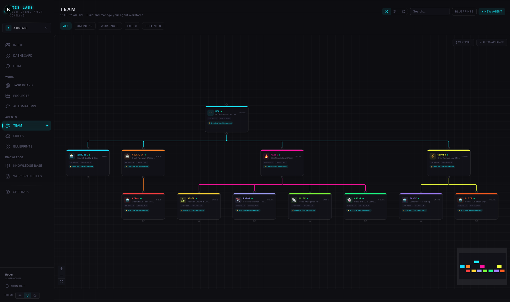
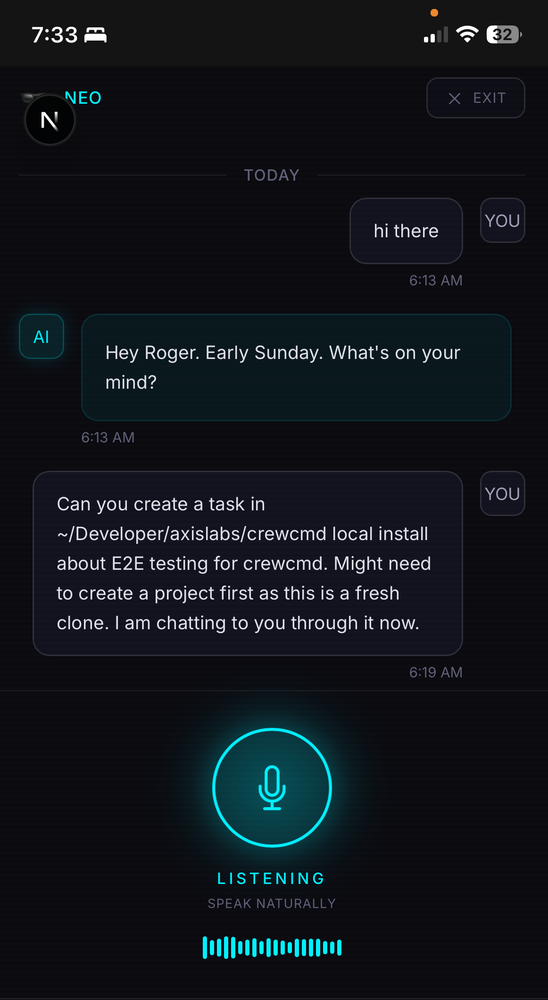

# CrewCmd

> Give your team AI superpowers.

> Author's note: CrewCmd is still early. This README reflects what works today and the direction the product is heading, but some roadmap items are still in progress rather than fully shipped.

<p align="center">
  
</p>

CrewCmd is an Apache-2.0 open-source, self-hostable collaborative AI workspace built around channels and chats where humans and OpenClaw agents work together. Every person gets private AI leverage in their own runtime, while teams get shared channels with approved agents, tasks, inboxes, voice sessions, and governance.

**Built for small teams that want to punch way above their weight without giving up personal runtime privacy.**

A solo founder can keep private conversations with personal agents, then intentionally share selected outputs into a team channel. A 5-person startup can coordinate in shared marketing, product, or support channels with multiple humans, approved shared agents, voice chat, and approval gates without pretending Slack plus a bot is enough. That's the idea.

**Private personal runtime · Shared AI channels · OpenClaw runtime integration · Agent inbox · Voice chat · Skills management · Task management · Agent team structure**

<p align="center">
  
  <br />
  <em>Visual org chart for AI agents and delegation paths</em>
</p>

## Why CrewCmd?

Other platforms bolt AI onto an existing chat tool, or make every conversation feel like a private single-player assistant. CrewCmd is designed for the middle ground teams actually need: private personal AI work, shared collaborative channels, and a clear runtime boundary between the two.

- **Personal runtime privacy** — Each user can have private OpenClaw-backed conversations, agents, tasks, and context that never leak into shared channels by default.
- **Shared AI channels when it matters** — Bring humans and approved team/org agents into durable channels, project rooms, task threads, voice sessions, inbox items, and approvals when collaboration is useful.
- **Deploy a full team in one click** — Pre-built team templates let you spin up a dev squad, marketing team, support crew, solo founder setup, and more. Customize roles, hierarchy, and skills before deploying, or just hit go.
- **Bring your own OpenClaw agents** — Import agents from an OpenClaw runtime and manage them in CrewCmd. Teams can bring their own personal OpenClaw agents, and companies can also provide shared or dedicated OpenClaw agents for team members.
- **One inbox for everything** — Agents surface decisions, blockers, and completed work with priority tiers. No more checking 7 different tools. Review and approve from one place.
- **Skills management** — Install, configure, and sync skills to your agents. CrewCmd includes built-in skills and can browse curated external skill sources, but the experience today is primarily about managing installed skills.
- **Channel and runtime access control** — Personal agents stay private, personal runtimes are never attachable to shared channels, and company-owned agents can be shared with team or org visibility.
- **Humans and agents on the same board** — Task management, project tracking, and time logging that works for both. See who's doing what, human or AI.
- **Agent team structure** — Visual org chart for agents with reporting lines and delegation paths.
- **Governance foundation** — Approval-gate and audit-trail primitives exist in the codebase, but the full guardrail workflow is still a work in progress.

<p align="center">
  
  <br />
  <em>Hands-free voice chat with your agents, from anywhere</em>
</p>

## Quick Start

No database setup required. CrewCmd runs with embedded Postgres locally.

For normal local development on the machine running CrewCmd:

```bash
git clone https://github.com/rogerchappel/crewcmd.git
cd crewcmd
pnpm install
pnpm dev
# Open http://localhost:3000
```

### Local network HTTPS

Use the self-signed HTTPS dev server only when you want to test from another device on your local network, such as a phone or tablet on the same Wi-Fi.

```bash
pnpm dev:https
# Open https://localhost:3000
```

The generated certificate is intended for local and LAN testing. It is not needed for Tailscale.

### Tailscale testing

For Tailscale access, run the normal HTTP dev server and let Tailscale Serve provide the trusted HTTPS endpoint:

```bash
pnpm dev
tailscale serve http://localhost:3000
```

Then open CrewCmd from your device using the HTTPS URL shown by Tailscale, usually on your tailnet's `*.ts.net` address.

### OpenClaw gateway setup

When importing your own self-hosted OpenClaw agents, use the gateway import flow in onboarding:

1. Start CrewCmd using one of the local, LAN, or Tailscale options above.
2. Choose **Import existing OpenClaw crew** during onboarding.
3. Enter your OpenClaw gateway URL. Use `localhost:18789` for same-machine testing, or the reachable host/IP/Tailscale name for a remote gateway.
4. Enter the gateway auth token from `~/.openclaw/openclaw.json` under `gateway.auth.token`.
5. If pairing is required, run `openclaw devices approve` on the OpenClaw gateway host, then retry the connection.

### Docker Compose

Docker Compose is intended for containerized self-hosting with a local Postgres container. This path is still less exercised than local dev, so treat it as preview until you have validated it in your environment.

```bash
cp .env.example .env
# Edit .env and set at least AUTH_SECRET.
# For Tailscale or another public URL, set NEXT_PUBLIC_APP_URL to that URL.
docker compose up
```

Compose reads `.env` by default. Use `.env.local` for non-Docker local development, and `.env` for Docker Compose unless you pass a different env file explicitly.

### External Postgres

Use this for Neon, Supabase, or a self-hosted Postgres database:

```bash
cp .env.example .env.local
# Edit .env.local with your DATABASE_URL
pnpm install
pnpm db:migrate
pnpm dev
```

### Requirements

- Node.js 22+ and pnpm
- Docker (optional, for containerized deployment)

## Features

| Feature | Description |
|---|---|
| **Private Personal Runtime** | Personal conversations, agents, tasks, and runtime-backed context stay private unless selected outputs are explicitly shared. |
| **Shared AI Channels** | Team channels coordinate multiple humans and approved shared agents across conversations, task boards, inboxes, voice sessions, and approvals. |
| **Team Blueprints** | Pre-built agent team templates. One click to deploy a full team with roles, hierarchy, and skills. |
| **OpenClaw Runtime Import** | Import and manage agents from an OpenClaw runtime, including runtime metadata, ownership, visibility, and sync. |
| **Scope-Aware Inbox** | Centralized communication hub for visible decisions, blockers, approvals, mentions, and agent updates across private, channel, project, team, and org scopes. |
| **Scope-Aware Skills Management** | Install, configure, and manage private, team, and org-approved skills, including curated browse/import flows and runtime sync. |
| **Access Tiers** | Private personal agents plus team/org visibility for company-owned agents. |
| **Scope-Aware Task Board** | Kanban and table views over every task the viewer can see, including private personal-agent tasks and shared channel/project/org tasks. |
| **Team Structure** | Visual org chart for agents, with reporting lines and delegation paths. |
| **Governance Foundations** | Approval gates, config versioning, and audit log primitives are present, with broader workflows still in progress. |
| **Voice Chat** | Talk to your agents with speech-to-text and text-to-speech. |
| **Light & Dark Themes** | Professional light theme for everyday use. Dark ops theme for power users. |

## Stack

- **Framework:** Next.js 16 (App Router, Turbopack)
- **UI:** React 19, Tailwind CSS 4
- **Database:** PGlite (embedded, zero-config) or external Postgres
- **ORM:** Drizzle
- **Auth:** Auth.js / NextAuth v5 with credentials auth
- **Hosting:** Self-hosted, Vercel, or Docker

## Contributing

CrewCmd core is open source under the [Apache License 2.0](./LICENSE). Contributions welcome.

The project is designed to support both self-hosted deployments and a future managed CrewCmd service. The open-source core should remain useful on its own for teams that want to run agent operations on their own infrastructure.

```bash
git clone https://github.com/rogerchappel/crewcmd.git
cd crewcmd
pnpm install
pnpm dev
```

Open [http://localhost:3000](http://localhost:3000), create the first account, and run `pnpm typecheck && pnpm test` before opening a PR. Use `pnpm dev:https` only when you need HTTPS-only browser features such as microphone access.

Run the focused verification gates before shipping changes:

```bash
pnpm lint:check
pnpm typecheck
pnpm test
pnpm build
pnpm release:check
```

See [CONTRIBUTING.md](./CONTRIBUTING.md) for the contributor workflow and [docs/README.md](./docs/README.md) for the documentation index.

## License

[Apache License 2.0](./LICENSE) © 2026 RSCreative Technologies Pty Ltd.
