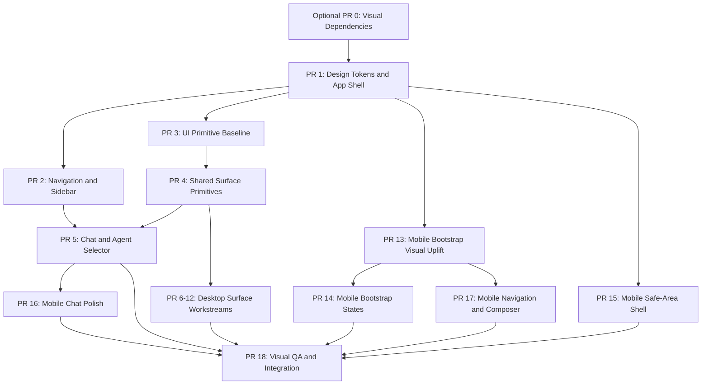

# Visual Uplift Orchestration Plan

Date: 2026-05-08

## Objective

Turn the visual uplift research brief into a reviewable implementation program across the full CrewCMD product: web app, chat, dashboard, operational pages, agent surfaces, settings/admin, and the Capacitor mobile app.

This plan is intentionally split for concurrent agents. Each workstream owns one branch and one PR. No shared implementation branch should be used unless a maintainer explicitly asks for a single combined PR.

## Source Inputs

- Design research: `docs/design/crewcmd-visual-uplift-research.md`
- Web token foundation: `src/app/globals.css`
- App shell: `src/components/app-shell.tsx`
- Desktop navigation: `src/components/sidebar.tsx`
- Chat and agent selector: `src/app/chat/page.tsx`, `src/components/chat/agent-tree-selector.tsx`
- Mobile shell: `apps/mobile/web/index.html`, `apps/mobile/web/styles.css`, `apps/mobile/web/app.js`

## Program Rules

- One workstream owns one branch and one PR.
- One PR contains one reviewable intent.
- Keep commits to three files or fewer unless the maintainer approves the exception before the commit.
- Do not mix dependency installation, token changes, component refactors, page redesign, mobile work, and visual QA in one commit.
- The final integration PR should contain only integration glue, conflict resolution, documentation updates, or end-to-end verification updates.
- Every implementation PR must include screenshots or a short manual QA note for desktop dark mode and mobile width where relevant.

## Dependency Graph

## Phase 0: Alignment

Owner: lead agent

Branch: no implementation branch required unless the brief changes

Task:

- Confirm the design brief is accepted or list amendments.
- Decide whether the first implementation should prioritize global tokens/app shell or visible navigation pain.
- Confirm whether `lucide-react`, Base UI, Radix primitives, or no new primitive dependency should be introduced.

Human decision needed:

- Approve the warm-neutral dark palette direction.
- Approve whether dependency additions are allowed in this visual uplift program.

### Optional PR 0: Visual Dependencies

Suggested branch: `codex/visual-foundation-dependencies`

Primary files:

- `package.json`
- `pnpm-lock.yaml`

Scope:

- Add `lucide-react` only if icon normalization is approved.
- Consider `@radix-ui/react-slot` only if shadcn-style polymorphic primitives are approved.
- Defer Radix popover/dialog/menu until a specific selector or sidebar behavior requires it.
- Do not add a styled component kit.
- Keep dependency and lockfile updates separate from visual component changes.

Verification:

- `pnpm install --lockfile-only` if dependency metadata is updated separately.
- `pnpm lint:check`
- `pnpm typecheck`
- `git diff --check`

Risk: low to medium, because dependency changes affect install/update flow. Ask before adding broader primitive dependencies.

## Phase 1: Foundation PRs

These are mostly sequential because downstream work should not redesign surfaces against unstable tokens.

### PR 1: Design Tokens and App Shell

Suggested branch: `codex/visual-foundation-tokens`

Primary files:

- `src/app/globals.css`
- `src/components/app-shell.tsx`
- Optional: `docs/design/crewcmd-visual-uplift-research.md` if the token decision changes

Scope:

- Retune dark tokens to warm charcoal and muted semantic colors.
- Add semantic aliases for chrome and controls: sidebar background/border, header background, control background/hover, control border/focus, selected background/text, overlay background, radius scale, and shadow scale.
- Remove or dramatically reduce teal/blue ambient backgrounds.
- Decide whether `grid-bg` remains opt-in instead of globally applied.
- Preserve light mode behavior unless a specific issue is discovered.
- Do not redesign page components in the same PR.

Verification:

- `pnpm lint:check`
- `pnpm typecheck`
- `git diff --check`
- Manual screenshots: dashboard, chat, settings at desktop and mobile widths.

Risk: medium, because global tokens affect every page.

### PR 2: Navigation and Sidebar

Suggested branch: `codex/visual-sidebar-navigation`

Base: PR 1 branch if stacked, otherwise latest `main` after PR 1 merges

Primary files:

- `src/components/sidebar.tsx`
- Optional: `src/components/company-switcher.tsx`
- Optional: `src/components/theme-toggle.tsx`

Scope:

- Remove uppercase navigation labels.
- Simplify selected state to one primary cue plus text contrast.
- Remove trailing active dots.
- Flatten the user footer and workspace selector.
- Keep collapsed sidebar behavior.

Verification:

- `pnpm lint:check`
- `pnpm typecheck`
- Manual QA: expanded/collapsed desktop sidebar, mobile drawer, light/dark themes.

Risk: medium, because navigation is global.

### PR 3: UI Primitive Baseline

Suggested branch: `codex/visual-ui-primitives`

Base: PR 1 branch if stacked, otherwise latest `main` after PR 1 merges

Primary files:

- `src/components/ui/button.tsx`
- `src/components/ui/badge.tsx`
- `src/components/ui/tabs.tsx`

Scope:

- Add the first tiny internal primitive layer without migrating every page.
- Use existing Tailwind/CSS variables.
- Use the existing `cn()` helper in `src/lib/utils.ts`.
- Do not add a large styled UI kit.
- If approved, add `lucide-react` in a separate dependency commit before icon migration.

Verification:

- `pnpm lint:check`
- `pnpm typecheck`
- `git diff --check`

Risk: low to medium, depending on dependency choice.

### PR 4: Shared Surface Primitives

Suggested branch: `codex/visual-shared-surfaces`

Base: PR 1 and PR 3 if stacked, otherwise latest `main` after they merge

Primary files, split further if needed:

- `src/components/avatar.tsx`
- `src/components/empty-state.tsx`
- `src/components/agent-card.tsx`
- `src/components/agent-runtime-badge.tsx`
- `src/components/activity-feed.tsx`

Scope:

- Normalize reusable avatar, empty state, card, badge, and activity-feed conventions.
- Keep behavior unchanged.
- Do not migrate every feature page in this PR.

Verification:

- `pnpm lint:check`
- `pnpm typecheck`
- Manual QA on pages that render these shared components.

Risk: medium, because these components fan out across multiple surfaces.

## Phase 2: Concurrent Surface PRs

These can run in parallel after PR 1 and PR 3 settle. Each workstream should own disjoint files.

### PR 5: Chat and Agent Selector

Suggested branch: `codex/visual-chat-agent-selector`

Primary files:

- `src/components/chat/agent-tree-selector.tsx`
- `src/app/chat/page.tsx`
- Optional: `src/components/chat/chat-message.tsx`

Scope:

- Neutralize agent selector colors.
- Restrict agent colors to small identity affordances.
- Reduce bright online dots and glows.
- Retune composer and message surfaces for all-day readability.

Verification:

- `pnpm lint:check`
- `pnpm typecheck`
- Manual QA: long conversation, agent menu, sessions tab, voice/attachment controls, desktop and mobile widths.

Risk: medium, because chat is the primary user workflow.

### PR 6: Dashboard, Inbox, and Work Overview

Suggested branch: `codex/visual-work-overview`

Primary files, split further if needed:

- `src/app/dashboard/page.tsx`
- `src/app/inbox/page.tsx`
- `src/app/projects/page.tsx`

Scope:

- Retune metric cards, inbox lists, work overview cards, and project summaries.
- Keep data loading and API calls unchanged.
- Prioritize scannability over decorative dashboard styling.

Verification:

- `pnpm lint:check`
- `pnpm typecheck`
- Manual QA: empty states, loaded states, light/dark modes.

Risk: medium.

### PR 7: Tasks and Project Execution

Suggested branch: `codex/visual-task-execution`

Primary files, split further if needed:

- `src/app/tasks/page.tsx`
- `src/components/task-board.tsx`
- `src/components/task-table.tsx`
- `src/components/task-dialog.tsx`

Scope:

- Retune kanban lanes, task tables, task cards, and task dialog hierarchy.
- Keep task creation/update behavior unchanged.
- Keep priority/status tokens semantic and restrained.

Commit split:

- Commit 1: task board/table surfaces.
- Commit 2: task dialog only.

Verification:

- `pnpm lint:check`
- `pnpm typecheck`
- Manual QA: board/list/dialog workflows.

Risk: medium.

### PR 8: Operational Secondary Pages

Suggested branch: `codex/visual-operational-pages`

Primary files, split further if needed:

- `src/app/automations/page.tsx`
- `src/app/heartbeats/page.tsx`
- `src/app/escalations/page.tsx`
- `src/app/governance/page.tsx`
- `src/app/budgets/page.tsx`
- `src/app/audit-log/page.tsx`

Scope:

- Retune schedules, runs, escalations, governance, budgets, and audit-list surfaces.
- Keep status/priority semantic and restrained.
- Avoid changing data behavior or API calls.

Commit split:

- Commit 1: automations/heartbeats only.
- Commit 2: escalations/governance only.
- Commit 3: budgets/audit log only.

Verification:

- `pnpm lint:check`
- `pnpm typecheck`
- Manual QA: empty states, loaded states, light/dark modes.

Risk: medium because multiple pages are visible and data-dense.

### PR 9: Team and Agent Management

Suggested branch: `codex/visual-team-agents`

Primary files, split further if needed:

- `src/app/agents/page.tsx`
- `src/app/team/page.tsx`
- `src/app/agents/[callsign]/page.tsx`
- `src/components/team-canvas/team-canvas.tsx`
- `src/components/team-canvas/agent-node.tsx`
- `src/components/agent-profile-panel.tsx`
- `src/components/agent-config-fields.tsx`
- `src/components/agent-control-panel.tsx`
- `src/components/agent-output-viewer.tsx`
- `src/components/new-agent-dialog.tsx`
- `src/components/edit-agent-dialog.tsx`

Scope:

- Reduce rainbow callsign styling.
- Make agent/team pages feel like professional operational dossiers.
- Keep agent behavior, sync, and skill invocation unchanged.

Commit split:

- Commit 1: team canvas/list.
- Commit 2: agent profile panel.
- Commit 3: agent form dialogs.
- Commit 4: agent output/control surfaces.

Verification:

- `pnpm lint:check`
- `pnpm typecheck`
- Manual QA: agent profile, team canvas/list, agent dialogs.

Risk: medium.

### PR 10: Skills and Blueprints Catalogs

Suggested branch: `codex/visual-skills-blueprints`

Primary files:

- `src/app/skills/page.tsx`
- `src/app/blueprints/page.tsx`
- Optional: shared catalog component if introduced in this PR

Scope:

- Make skills and blueprints feel like compact catalogs.
- Normalize search/filter/action hierarchy.
- Keep import/sync/deploy behavior unchanged.

Verification:

- `pnpm lint:check`
- `pnpm typecheck`
- Manual QA: browse, filter, empty state, action buttons.

Risk: medium.

### PR 11: Settings, Admin, and Configuration

Suggested branch: `codex/visual-settings-admin`

Primary files, split further if needed:

- `src/app/settings/page.tsx`
- `src/app/settings/company/page.tsx`
- `src/app/dashboard/settings/page.tsx`
- `src/app/dashboard/settings/service-secrets/page.tsx`
- `src/app/models/page.tsx`
- `src/app/agents/access/page.tsx`

Scope:

- Move settings/admin to conservative enterprise forms and section hierarchy.
- Keep danger/destructive actions explicit.
- Do not change auth, secrets, billing, production config, telemetry, or permissions behavior.

Verification:

- `pnpm lint:check`
- `pnpm typecheck`
- Manual QA: forms, save/cancel states, dangerous actions still visually distinct.

Risk: medium to high if any security/admin behavior is touched. Stop and ask before behavior changes.

### PR 12: Knowledge, Docs, Office, and Entry Flows

Suggested branch: `codex/visual-entry-knowledge`

Primary files, split further if needed:

- `src/app/documents/page.tsx`
- `src/app/docs/page.tsx`
- `src/app/office/page.tsx`
- `src/app/office/office.css`
- `src/app/page.tsx`
- `src/app/onboarding/page.tsx`
- `src/app/join/page.tsx`
- `src/app/access-denied/page.tsx`
- `src/app/invite/[token]/page.tsx`

Scope:

- Align knowledge/document/office and entry surfaces with the new product language.
- Keep auth, invite, signup, and onboarding behavior unchanged.
- Treat `src/app/office/office.css` as a CSS island and avoid dragging unrelated page CSS into it.

Verification:

- `pnpm lint:check`
- `pnpm typecheck`
- Manual QA: entry/onboarding/invite paths and office/docs/document pages.

Risk: medium; stop before changing auth or invite behavior.

## Phase 3: Mobile PRs

Mobile can start after PR 1 establishes tokens. It should not wait for every desktop surface.

### PR 13: Capacitor Bootstrap Tokens and Visual Uplift

Suggested branch: `codex/visual-mobile-bootstrap`

Primary files:

- `apps/mobile/web/index.html`
- `apps/mobile/web/styles.css`

Scope:

- Refresh the static bootstrap shell.
- Replace cyan/teal mobile palette with warm-neutral tokens aligned to web.
- Improve first-screen scanability.
- Reduce heavy animated orb/ambient effects.
- Keep JavaScript behavior unchanged.

Verification:

- `node apps/mobile/scripts/check-web-assets.mjs`
- Manual browser/mobile viewport smoke of `apps/mobile/web/index.html`.

Risk: medium.

### PR 14: Capacitor Bootstrap States

Suggested branch: `codex/visual-mobile-bootstrap-states`

Primary files:

- `apps/mobile/web/app.js`
- `apps/mobile/web/styles.css`

Scope:

- Improve loading/error/connected/disabled/manual states.
- Add or improve reduced-motion handling if needed.
- Keep deep-link, preferences, haptics, and connection behavior intact.

Verification:

- `node apps/mobile/scripts/check-web-assets.mjs`
- Manual QA: connected, error, disabled, manual recovery states.

Risk: medium.

### PR 15: Mobile Safe-Area Shell

Suggested branch: `codex/visual-mobile-safe-area-shell`

Primary files:

- `src/app/globals.css`
- `src/components/app-shell.tsx`
- `src/components/sidebar.tsx`
- Optional: `src/components/theme-provider.tsx`

Scope:

- Consolidate mobile app bar and safe-area behavior.
- Avoid double top padding and clipped bottom controls.
- Verify native status bar color after token changes.

Verification:

- `pnpm lint:check`
- `pnpm typecheck`
- Manual QA: drawer over chat, top app bar, safe areas, iOS/Android-sized viewports.

Risk: medium.

### PR 16: Mobile Chat Polish

Suggested branch: `codex/visual-mobile-chat-polish`

Primary files:

- `src/app/chat/page.tsx`
- Optional: chat subcomponents only if necessary

Scope:

- Improve mobile chat input, add menu, scroll affordances, and agent mode spacing.
- Test keyboard/composer growth and `100dvh` behavior.
- Avoid behavior changes to streaming, push registration, or attachments.

Verification:

- `pnpm lint:check`
- `pnpm typecheck`
- Manual QA: `/chat` at 390x844 and 430x932, keyboard input growth, add-file popover, camera file input, agent mode, theme/status bar colors.

Risk: medium to high because chat is the primary mobile workflow.

### PR 17: Mobile Navigation and Composer

Suggested branch: `codex/visual-mobile-navigation-composer`

Base: PR 13 branch if stacked, otherwise latest `main` after it merges

Primary files:

- `apps/mobile/web/app.js`
- `apps/mobile/web/styles.css`
- Optional: `apps/mobile/README.md`

Scope:

- Make mobile navigation thumb-friendly.
- Prefer bottom navigation or compact top app bar over desktop-like drawer patterns.
- Use full-height sheets for agent/session selection patterns where possible.
- Stabilize composer/input behavior around keyboard and safe areas.

Verification:

- `node apps/mobile/scripts/check-web-assets.mjs`
- Manual QA: iPhone-size viewport, Android-size viewport, keyboard/composer, offline/reconnect display.

Risk: medium.

## Phase 4: Integration and QA

### PR 18: Visual QA Harness and Integration

Suggested branch: `codex/visual-uplift-integration-qa`

Primary files:

- `docs/plans/visual-uplift-orchestration-plan.md`
- Optional: focused Playwright screenshot spec under `e2e/`
- Optional: QA checklist under `docs/design/`

Scope:

- Rebase or update downstream branches after foundation PRs merge.
- Resolve style collisions only.
- Add a repeatable manual/automated screenshot checklist.
- Confirm no PR diff contains unrelated workstream changes.

Verification:

- `pnpm lint:check`
- `pnpm typecheck`
- `pnpm test:e2e` if a focused visual smoke exists
- Manual QA checklist across desktop, mobile web, and Capacitor shell.

Risk: medium, because integration can hide accidental scope creep.

## Suggested Concurrent Agent Assignments

After PR 1 is merged or accepted as a stack base:

- Agent A: Sidebar/navigation PR.
- Agent B: UI primitive baseline PR.
- Agent C: Capacitor bootstrap visual uplift PR.
- Agent D: Mobile safe-area shell PR.

After PR 3 and PR 4 are merged or accepted as stack bases:

- Agent E: Chat and agent selector PR.
- Agent F: Dashboard/inbox/projects PR.
- Agent G: Tasks/project execution PR.
- Agent H: Operational secondary pages PR.
- Agent I: Team and agent management PR.
- Agent J: Skills and blueprints PR.
- Agent K: Settings/admin/configuration PR.
- Agent L: Entry/knowledge/office PR.
- Agent M: Mobile bootstrap states PR.
- Agent N: Mobile chat polish PR.
- Agent O: Mobile navigation/composer PR, stacked only within the mobile track.

Lead agent responsibilities:

- Keep branch bases clean.
- Confirm each remote branch has one intended PR.
- Check each PR file list before publishing.
- Prevent multiple agents from editing the same file in parallel.
- Own final integration and QA only after individual PRs are reviewable.

## File Ownership Matrix

| Workstream | Owns | Must avoid |
| --- | --- | --- |
| Foundation tokens | `src/app/globals.css`, `src/components/app-shell.tsx` | Page-specific redesigns |
| Sidebar | `src/components/sidebar.tsx`, company/theme sidebar support | Chat page internals |
| Primitives | `src/components/ui/*` | Migrating many pages at once |
| Chat | `src/app/chat/page.tsx`, `src/components/chat/*` | Global tokens after PR 1 |
| Work overview | Dashboard, inbox, projects | Task board and agent pages |
| Task execution | Tasks, task board/table/dialog | Dashboard and agent pages |
| Operational pages | Automations, heartbeats, escalations, governance, budgets, audit log | Settings/security behavior |
| Team/agents | Agents, team canvas, agent profile/dialog/control/output | Runtime/API behavior |
| Skills/blueprints | Skills, blueprints | Agent runtime behavior |
| Settings/admin | Settings, models, service secrets, access | Auth/security behavior changes |
| Entry/knowledge | Documents, docs, office, onboarding, join, invite, access denied | Auth/invite behavior changes |
| Mobile bootstrap | `apps/mobile/web/index.html`, `apps/mobile/web/styles.css`, `apps/mobile/web/app.js` | Web app token changes unless shared explicitly |
| Mobile app shell | `src/app/globals.css`, `src/components/app-shell.tsx`, `src/components/sidebar.tsx`, `src/components/theme-provider.tsx` | Chat behavior changes |
| Mobile chat | `src/app/chat/page.tsx`, focused chat subcomponents | Streaming/push/attachment behavior changes |
| Integration QA | Docs/checklists/focused e2e | New visual direction changes |

## Verification Baseline

Every PR:

- `git diff --check`
- `pnpm lint:check`
- `pnpm typecheck`

Page/surface PRs:

- Manual dark/light QA.
- Desktop width around 1440px.
- Mobile width around 390px.

Mobile PRs:

- `node apps/mobile/scripts/check-web-assets.mjs`
- iOS-sized and Android-sized viewport smoke.
- Safe-area and keyboard/composer checks.

## Rollback Strategy

- Foundation rollback: revert PR 1 and pause dependent PRs.
- Surface rollback: revert the individual PR; no other workstream should depend on page-specific visual changes.
- Mobile rollback: revert mobile PRs independently from web app PRs.
- Dependency rollback: if `lucide-react`, Base UI, or Radix creates friction, revert the dependency PR before migrating surfaces.

## Human Decisions Before Implementation

- Approve the global warm-neutral token direction.
- Choose whether `grid-bg` is removed globally or made page-specific.
- Approve dependency additions: `lucide-react`, Base UI/Radix, or no dependency.
- Choose stacked PRs versus merge-after-review sequencing.
- Confirm whether mobile should use bottom navigation, compact top navigation, or a hybrid.
